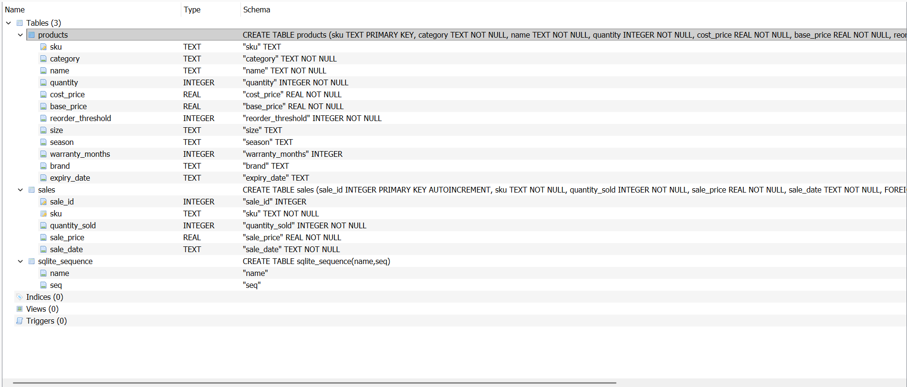
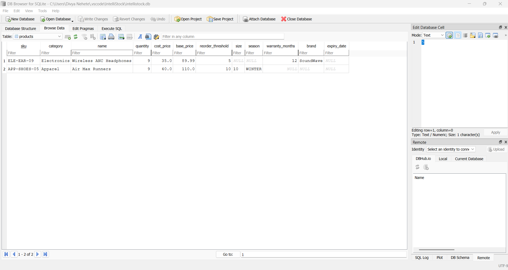
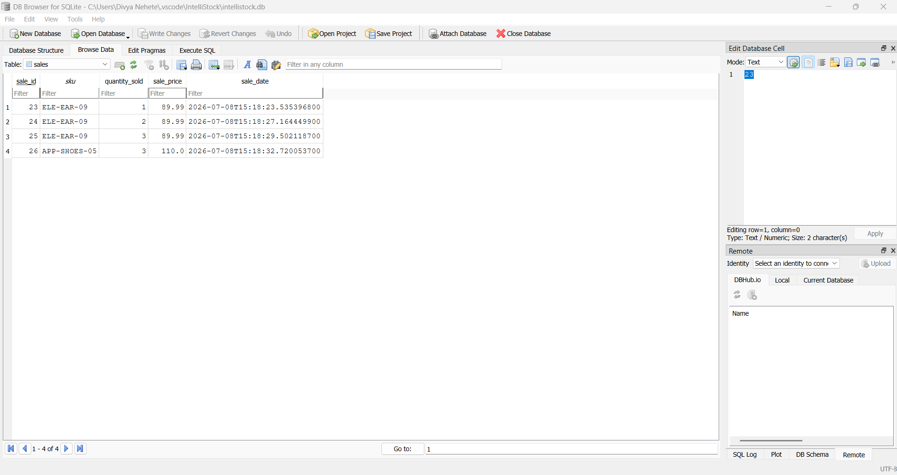
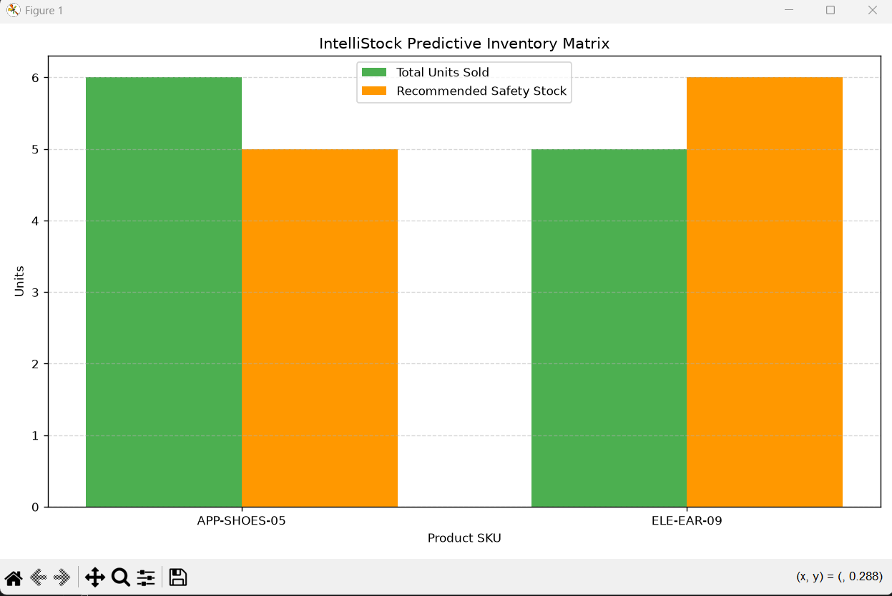
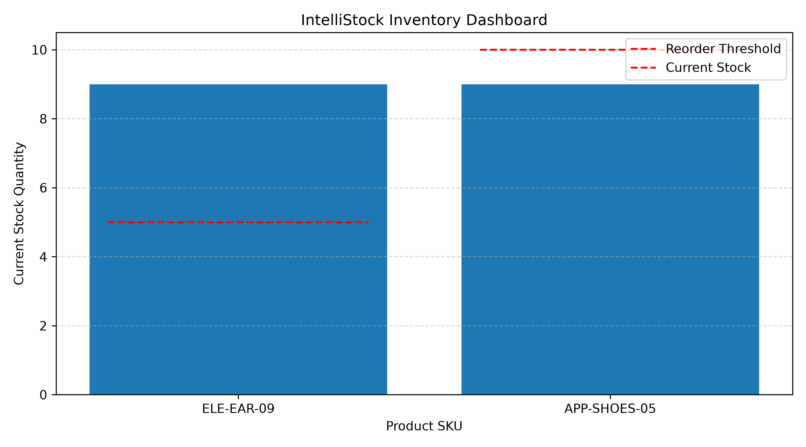
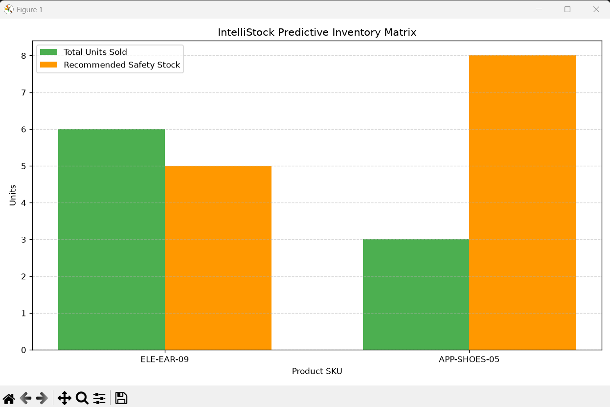
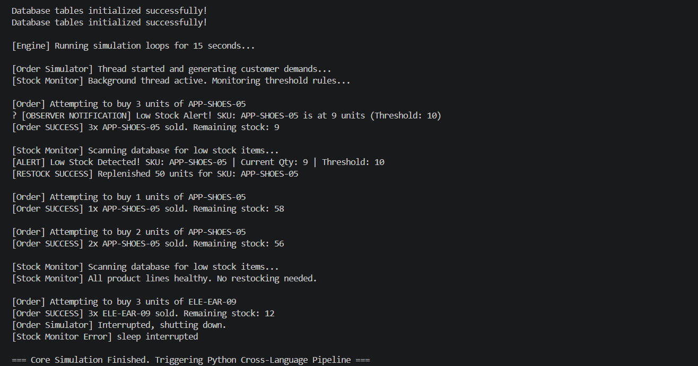

# IntelliStock
### Smart Multithreaded Inventory Management System with SQLite & Python Analytics


## Overview

IntelliStock is a multithreaded inventory management system developed in Java that simulates real-world warehouse operations.

The system manages products, processes customer orders, automatically detects low stock levels, restocks inventory, stores sales records in an SQLite database, and generates analytical dashboards using Python.

This project demonstrates Java Object-Oriented Programming, JDBC database connectivity, multithreading, design patterns, exception handling, and cross-language integration with Python.

---

## Features

- Product Inventory Management
- SQLite Database Integration using JDBC
- Customer Order Simulation
- Automatic Stock Monitoring
- Auto Restocking Engine
- Multithreading using Java Threads
- Observer Pattern for Low Stock Alerts
- Factory Pattern for Product Creation
- Repository Pattern for Database Access
- Python Analytics Dashboard
- Sales Dashboard
- Exception Handling
- Modular Project Structure

---

## Technologies Used

| Technology | Purpose |
|------------|---------|
| Java | Core Application |
| SQLite | Database |
| JDBC | Database Connectivity |
| Python | Data Analytics |
| Matplotlib | Dashboard Visualization |
| VS Code | Development Environment |
| Git & GitHub | Version Control |

---

# Project Structure

```
IntelliStock
│
├── lib/
│   ├── sqlite-jdbc.jar
│   ├── slf4j-api.jar
│   └── slf4j-simple.jar
│
├── screenshots/
│
├── src/
│   └── main/java
│       ├── exception/
│       ├── interfaces/
│       ├── jdbc/
│       ├── pricing/
│       ├── products/
│       ├── service/
│       └── simulation/
│
├── analytics.py
├── inventory_dashboard.py
├── schema.sql
├── intellistock.db
├── README.md
└── .gitignore
```

---

# System Workflow

```
Customer Orders
        │
        ▼
Order Simulator Thread
        │
        ▼
Inventory Service
        │
        ▼
SQLite Database
        ▲
        │
Stock Monitor Thread
        │
        ▼
Automatic Restocking
        │
        ▼
Sales Analytics (Python)
```

---

# Screenshots
## Package Structure 


---

## Database Structure



---

## Products Table



---

## Sales Table



---

## Multithreaded Simulation Output



---

## Inventory Dashboard



---

## Sales Analytics Dashboard



---

## Java Simulation Code



---

# Design Patterns Used

### Repository Pattern

Separates database operations from business logic.

Example:

- ProductRepository
- SalesRepository

---

### Factory Pattern

Creates different product types from database records.

Example:

- ProductFactory

---

### Observer Pattern

Automatically notifies listeners when inventory reaches the reorder threshold.

Example:

- StockAlertObserver
- ConsoleAlertLogger

---

# Multithreading

The simulation uses two independent threads:

### Order Simulator Thread

- Generates random customer purchases
- Updates inventory
- Records sales

### Stock Monitor Thread

- Continuously scans inventory
- Detects low stock
- Automatically replenishes products

Both threads work simultaneously on the shared inventory database.

---

# Database Schema

### Products Table

| Column |
|---------|
| SKU |
| Category |
| Name |
| Quantity |
| Cost Price |
| Base Price |
| Reorder Threshold |
| Size |
| Season |
| Warranty |
| Brand |
| Expiry Date |

---

### Sales Table

| Column |
|---------|
| Sale ID |
| SKU |
| Quantity Sold |
| Sale Price |
| Timestamp |

---

# Python Analytics

The project includes Python scripts that visualize inventory and sales information using Matplotlib.

Current dashboards include:

- Inventory Dashboard
- Sales Dashboard

These dashboards directly read data from the SQLite database.

---

# How to Run

## Compile

```bash
javac -cp ".;lib/*" -d bin src/main/java/exception/*.java src/main/java/interfaces/*.java src/main/java/pricing/*.java src/main/java/products/*.java src/main/java/jdbc/*.java src/main/java/service/*.java src/main/java/simulation/*.java
```

---

## Run Simulation

```bash
java -cp "bin;lib/*" simulation.SimulationTest
```

---

## Run Python Analytics

Inventory Dashboard

```bash
python inventory_dashboard.py
```

Sales Dashboard

```bash
python analytics.py
```

---

# Sample Console Output

```
[Order Simulator] Thread started...

[Order SUCCESS] 3x APP-SHOES-05 sold.

[ALERT] Low Stock Detected!

[RESTOCK SUCCESS] Replenished 50 units.

[Stock Monitor] All product lines healthy.

=== Core Simulation Finished ===
```

---

# Learning Outcomes

This project demonstrates:

- Java Object-Oriented Programming
- Multithreading
- SQLite Database Design
- JDBC
- Factory Pattern
- Repository Pattern
- Observer Pattern
- Exception Handling
- Concurrent Programming
- Python Data Visualization
- Git & GitHub

---

# Future Improvements

- JavaFX Desktop GUI
- REST API using Spring Boot
- Machine Learning Demand Prediction
- User Authentication
- Docker Deployment
- Cloud Database Support

---

# Author

**Divya Nehete**

GitHub: https://github.com/Divya02-coder

LinkedIn: https://www.linkedin.com/in/divya-p-nehete-9a07a3254/

---